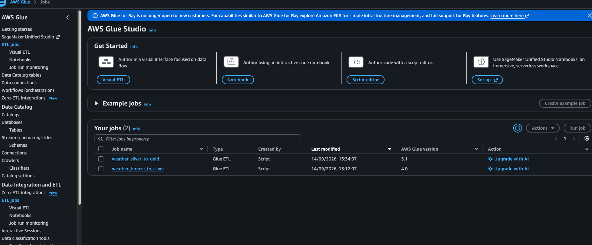
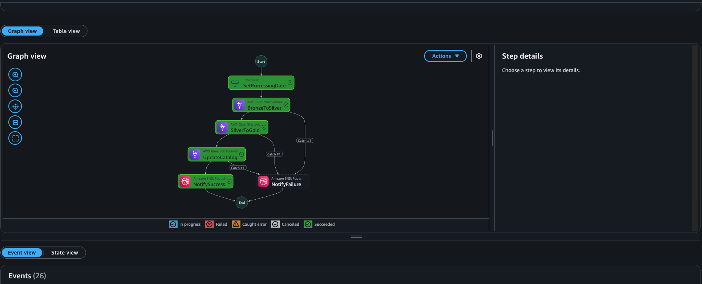
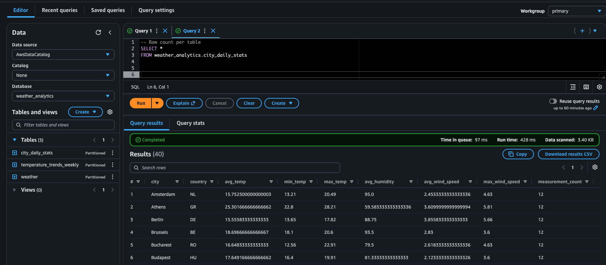

# AWS Weather Data Pipeline

> A production-style serverless ETL pipeline on AWS that ingests weather data from the OpenWeatherMap API, processes it through a **Bronze → Silver → Gold** Medallion architecture, and exposes curated datasets for analytics with Amazon Athena.


---

## Architecture


### End-to-End Data Flow

```text
EventBridge
     │
     ▼
AWS Lambda (20 cities)
     │
     ▼
S3 Bronze (Raw JSON)
     │
     ▼
Glue Job (Bronze → Silver)
     │
     ▼
S3 Silver (Clean Parquet)
     │
     ▼
Glue Job (Silver → Gold)
     │
     ▼
S3 Gold (Business Tables)
     │
     ▼
Athena Analytics
```

The pipeline runs automatically every hour, storing raw weather observations in the Bronze layer before progressively transforming them into analytics-ready datasets.

---

## Tech Stack

### Compute & Orchestration

- AWS Lambda — event-driven ingestion
- AWS Glue Spark Jobs — distributed transformations
- AWS Step Functions — workflow orchestration
- Amazon EventBridge — scheduled triggers

### Storage & Catalog

- Amazon S3 — Bronze, Silver and Gold data lake
- AWS Glue Data Catalog — metadata management
- AWS Glue Crawlers — automatic schema discovery

### Analytics

- Amazon Athena — SQL queries directly on S3

### Security & Observability

- AWS Secrets Manager — API key storage
- Amazon CloudWatch — logs, metrics and dashboards
- Amazon SNS — success and failure alerts
- AWS IAM — least-privilege service roles

---

## Key Features

- **Hourly event-driven ingestion** for 20 European cities
- **Bronze → Silver → Gold** Medallion architecture
- **Parallel API requests** using Python's `ThreadPoolExecutor`
- **Incremental idempotent processing** with dynamic partition overwrite
- **Full reload support** using `--processing_date=all`
- **Automatic SNS notifications** on success and failure
- **Infrastructure as Code** with Terraform
- **Athena-ready Parquet datasets** optimized for analytics

---

## Repository Structure

```text
weather-data-pipeline/
├── src/
│   ├── lambda/
│   └── glue/
├── stepfunctions/
├── terraform/
│   ├── modules/
│   └── main.tf
├── athena/
├── scripts/
├── docs/
│   ├── architecture.png
│   └── screenshots/
└── README.md
```

---

## Quick Start

### Prerequisites

- AWS CLI configured with appropriate permissions
- Terraform ≥ 1.5
- Python 3.11+
- OpenWeatherMap API key

### 1. Deploy the Infrastructure

```bash
cd terraform

terraform init
terraform apply
```
### 2. Store the API Key

```bash
aws secretsmanager create-secret \
  --name openweathermap/api_key \
  --secret-string '{"api_key":"YOUR_KEY"}'
```

### 3. Deploy the Application Code

```bash
cd ..

./scripts/deploy_glue_scripts.sh
./scripts/deploy_lambda.sh
```

---

## Running the Pipeline

### Trigger a Full Reload

```bash
aws stepfunctions start-execution \
  --state-machine-arn $(terraform -chdir=terraform output -raw full_reload_state_machine_arn) \
  --input '{}'
```
### Trigger the Daily Pipeline

```bash
aws stepfunctions start-execution \
  --state-machine-arn $(terraform -chdir=terraform output -raw daily_state_machine_arn) \
  --input '{}'
```

---

## Querying with Athena

Example analytical query:

```sql
SELECT
    date,
    COUNT(*) AS records
FROM weather_analytics.city_daily_stats
GROUP BY date
ORDER BY date DESC;
```

---

## Data Quality Controls

The Spark transformations enforce several validation rules before promoting data.

| Validation | Purpose |
|------------|---------|
| Temperature between **-50°C and 60°C** | Remove implausible values |
| Humidity between **0% and 100%** | Validate sensor data |
| Deduplication by **city + hour** | Keep the latest ingestion |
| Null safety | Preserve critical fields |

---

## Monitoring & Alerting

The pipeline includes built-in operational monitoring.

- CloudWatch logs, metrics and dashboards
- Step Functions execution tracking
- SNS notifications for successful and failed executions

---

## Cost Estimate

| Service | Estimated Monthly Cost |
|----------|-------------------------|
| Lambda | Minimal |
| Glue | Low |
| S3 | Minimal |
| Athena | Pay-per-query |
| **Total** | **Under $5/month** |

This estimate assumes hourly Lambda ingestion, daily Glue jobs, and occasional Athena queries.

---

## Screenshots

### CloudWatch Dashboard



### Step Functions Execution



### Athena Query Results



---

## Author

**Anass Lagraini**

Data Engineer

- LinkedIn: <https://linkedin.com/in/anass-lagraini>
- Email: <anass.lagraini94@gmail.com>

---

## License

This project is released under the **MIT License**.